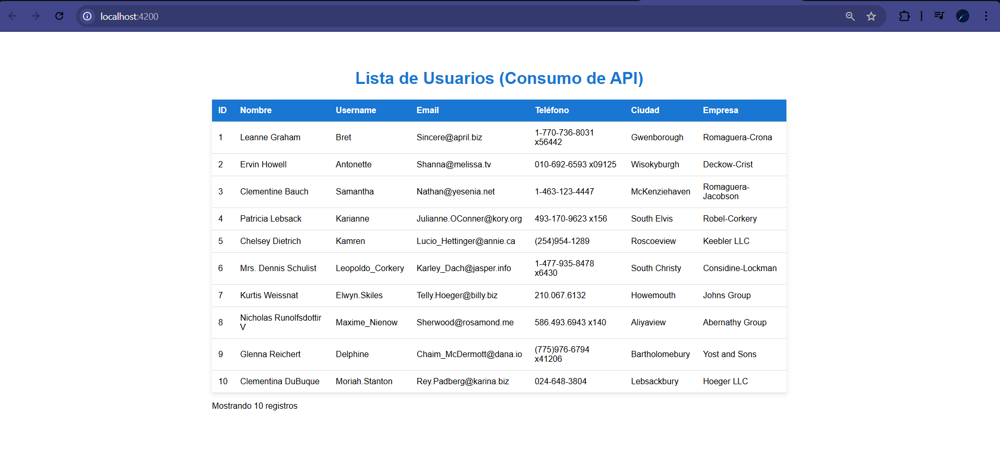

# 3_BrandoLucana_TallerII

## Consumo de API en Angular

Aplicación Angular que consume la API pública de JSONPlaceholder y muestra una lista de usuarios en una tabla.

## Captura de la aplicación
AQUI SE ENCUENTRA LA CAPTURA COMO 2da EVIDENCIA en la carpeta de "assets"




## Cómo ejecutar
```bash
npm install
ng serve
```

Abrir en el navegador: http://localhost:4200